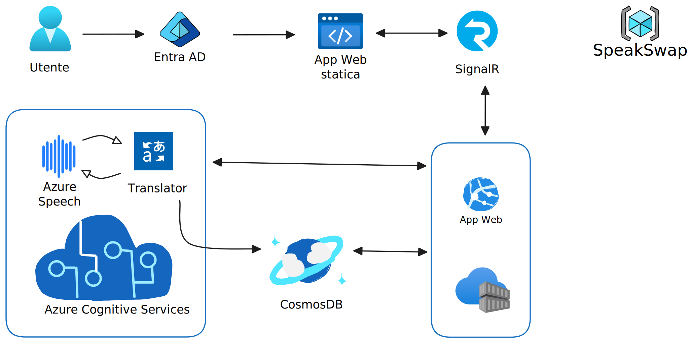

# 🎤 SpeakSwap

> **Real-time Multilingual Chat Platform with Voice Translation**

Una piattaforma di chat innovativa che abbatte le barriere linguistiche permettendo comunicazione fluida tra persone di lingue diverse attraverso traduzione automatica in tempo reale di messaggi vocali e testuali.

[](https://azure.microsoft.com)
[](https://reactjs.org)
[](https://dotnet.microsoft.com/apps/aspnet/signalr)
[](https://dotnet.microsoft.com)

---

## 🌟 **Caratteristiche Principali**

### ✨ **Funzionalità Core**

- 🗣️ **Chat vocale multilingua** con traduzione automatica in tempo reale
- 💬 **Messaggi di testo** tradotti istantaneamente
- 🏠 **Stanze temporanee** con link di invito privati
- 🔐 **Autenticazione Microsoft Entra ID** per sicurezza enterprise
- ⚡ **Comunicazione real-time** tramite WebSocket
- 📚 **Storico conversazioni**

### 🌍 **Lingue Supportate**

- 🇮🇹 **Italiano**
- 🇺🇸 **English**
- 🇫🇷 **Français**
- 🇪🇸 **Español**
- 🇩🇪 **Deutsch**

---

## 🏗️ **Architettura Cloud**



### **Frontend**

- **React.js** con routing dinamico
- **Azure Static Web Apps** per hosting e CI/CD
- **MSAL.js** per autenticazione Microsoft Entra ID
- **SignalR Client** per comunicazione real-time

### **Backend**

- **ASP.NET Core** con SignalR Hub per real-time messaging
- **Azure SignalR Service** per scalabilità automatica
- **FFmpeg** per conversione audio (WebM → WAV)
- **Gestione sessioni** con UUID tracking e retry logic

### **Servizi Azure**

- 🧠 **Azure Cognitive Services**
  - **Speech-to-Text** per riconoscimento vocale multilingua
  - **Text-to-Speech** con voci neurali di alta qualità
  - **Translator** per traduzione automatica
- 💾 **Azure Cosmos DB** per persistenza dati NoSQL
- 🔐 **Microsoft Entra ID** per autenticazione enterprise
- ⚡ **Azure SignalR Service** per real-time scaling

---

## 🚀 **Quick Start**

### **Prerequisiti**

- 🐳 **Docker** installato
- 🔑 **Account Azure** con accesso ai servizi Cognitive Services, Cosmos DB e SignalR Service
- 🗝️ **Microsoft Entra ID** configurato per l'autenticazione

### **Configurazione Ambiente**

1. **Clona il repository**

   ```bash
   git clone https://github.com/GiovanniForlenza/SpeakSwap.git
   cd SpeakSwap
   ```

2. **Configura le variabili d'ambiente**

   Crea un file `.env` nella root del progetto:

   ```env
   # Azure Cognitive Services
   AZURE_SPEECH_KEY=your_speech_service_key
   AZURE_SPEECH_REGION=your_speech_region
   AZURE_TRANSLATOR_KEY=your_translator_key
   AZURE_TRANSLATOR_REGION=your_translator_region

   # Azure Cosmos DB
   COSMOS_DB_CONNECTION_STRING=your_cosmos_connection_string
   COSMOS_DB_DATABASE_NAME=SpeakSwapDB
   COSMOS_DB_CONTAINER_NAME=Messages

   # Azure SignalR Service
   AZURE_SIGNALR_CONNECTION_STRING=your_signalr_connection_string

   # Microsoft Entra ID
   AZURE_CLIENT_ID=your_client_id
   AZURE_TENANT_ID=your_tenant_id
   AZURE_CLIENT_SECRET=your_client_secret

   # Application Settings
   ASPNETCORE_ENVIRONMENT=Development
   REACT_APP_API_URL=http://localhost:5000
   ```

### **Avvio Manuale dei Container**

#### **1. Server Backend**

```bash
# Build del container server
docker build -f dockerfile.server -t speakswap-server .

# Avvio del server
docker run -d \
  --name speakswap-server \
  -p 8081:8081 \
  --env-file .env \
  speakswap-server
```

#### **2. Client Frontend**

```bash
# Build del container client
docker build -f dockerfile.client -t speakswap-client .

# Avvio del client
docker run -d \
  --name speakswap-client \
  -p 3000:3000 \
  --env-file .env \
  speakswap-client
```

### **Test dell'Applicazione**

1. 🌐 Naviga su http://localhost:3000
2. 🔐 Effettua il login con Microsoft Entra ID
3. 🏠 Crea una nuova stanza o unisciti ad una esistente
4. 🎤 Testa la funzionalità di traduzione vocale
5. 💬 Invia messaggi di testo in diverse lingue

**Problemi comuni:**

- ❌ **Errore di autenticazione**: Verifica le credenziali Azure nel file `.env`
- 🔊 **Audio non funziona**: Controlla che il browser abbia i permessi per il microfono
- 🌐 **Problemi di rete**: Assicurati che le porte 8081 e 3000 siano libere
- 🔧 **Errori di build**: Esegui `docker system prune` per pulire la cache Docker

---

### **Costi Stimati Produzione**

```
Uso Moderato (100 utenti/giorno):
├── Static Web Apps: €0 (free tier)
├── SignalR Service: €25/mese (Standard)
├── Cosmos DB: €24/mese (400 RU/s)
├── Speech Services: €15/mese (~1000 min)
├── Translator: €10/mese (~500K caratteri)
└── App Service: €50/mese (Basic B1)
──────────────────────────────────
TOTALE: ~€124/mese
```

---

## 🚀 **Future Developments**

- 📹 **Video chat** con sottotitoli tradotti in tempo reale
- 🎭 **Voice cloning** per mantenere tono originale
- 📱 **Mobile app** React Native per iOS/Android
- 🌍 **Supporto lingue aggiuntive** (Cinese, Giapponese, Arabo)

---

## 📞 **Contatti**

- 📧 **Email**: [g.forlenza@studenti.unisa.it]
- 🐛 **Bug Reports**: [GitHub Issues](https://github.com/gforlenza/speakswap/issues)
- 🎓 **Università**: [Università degli Studi di Salerno](https://www.unisa.it)

---

<div align="center">

**🌟 Se SpeakSwap ti è utile, lascia una stella! ⭐**

**Made with ❤️ and Azure ☁️ in Italy 🇮🇹**

</div>
